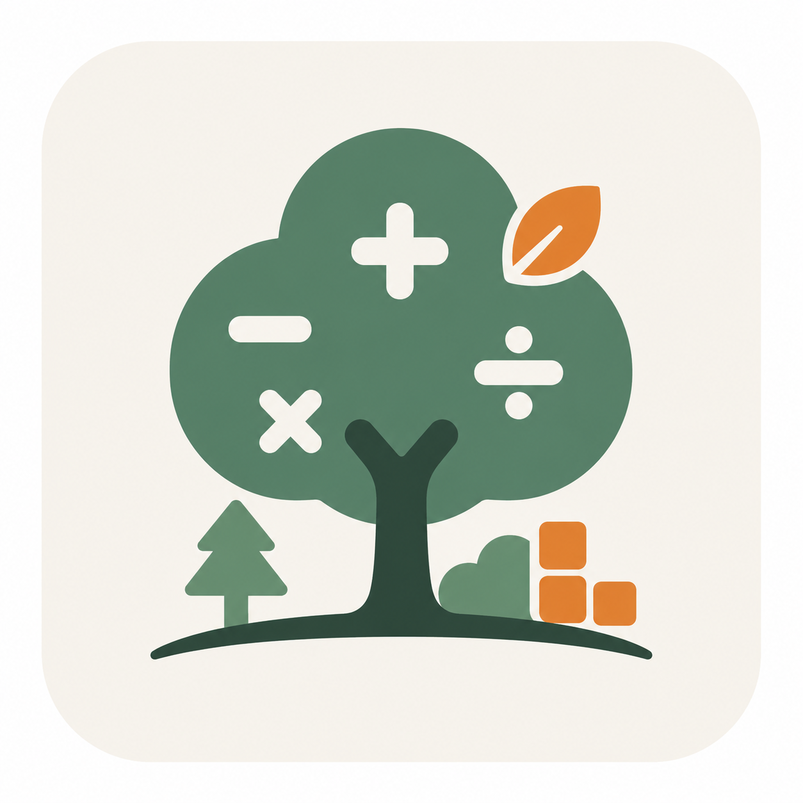
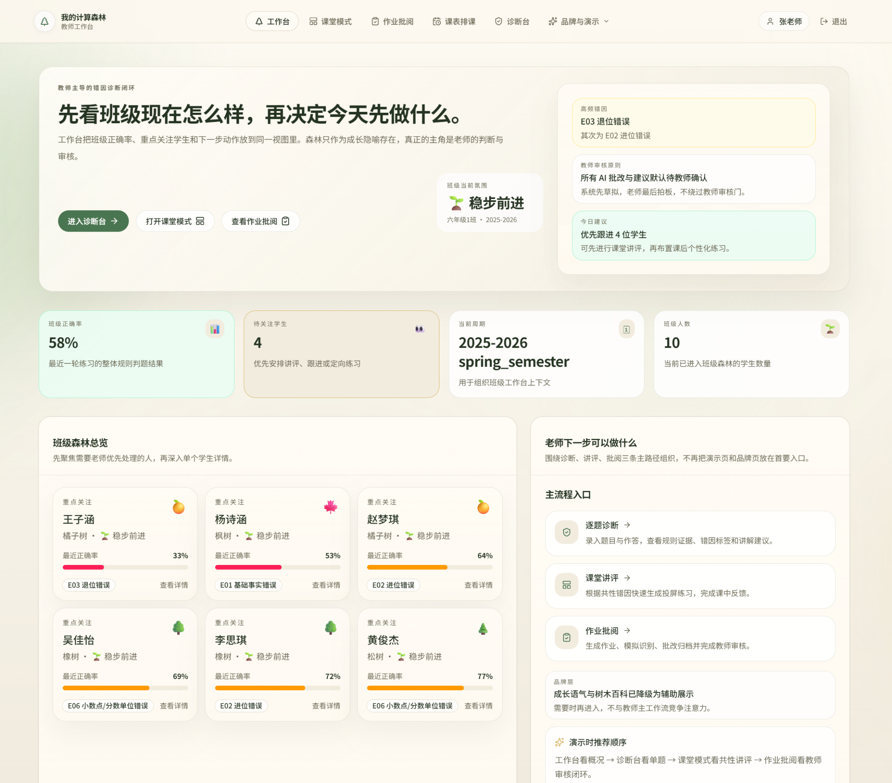
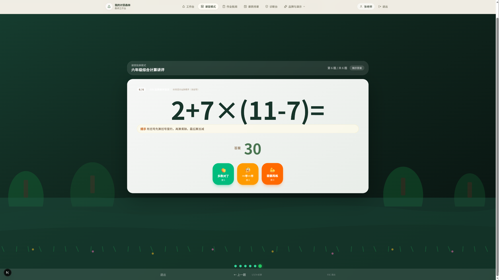
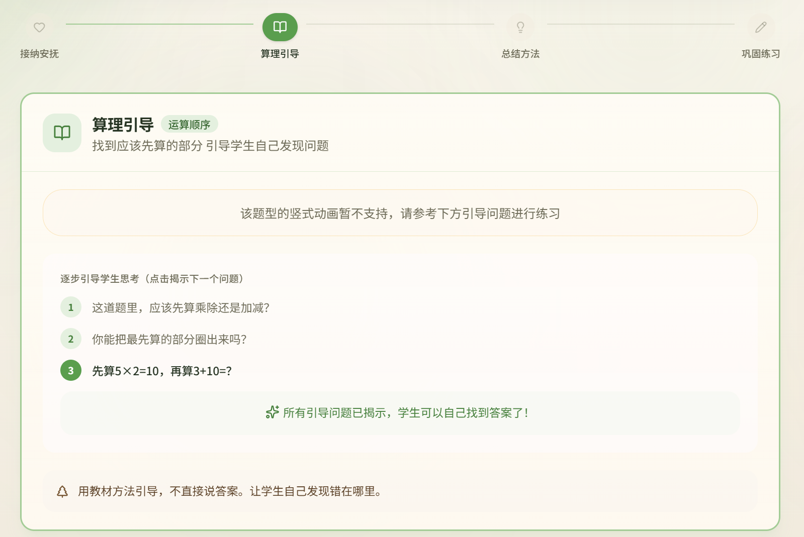
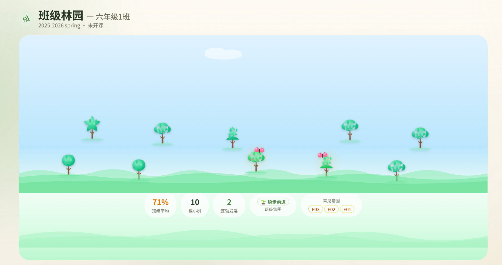
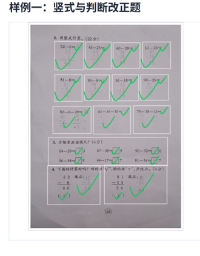
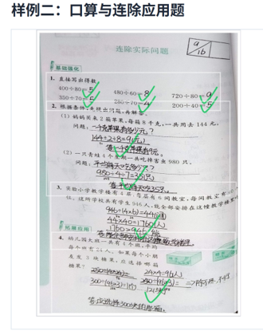
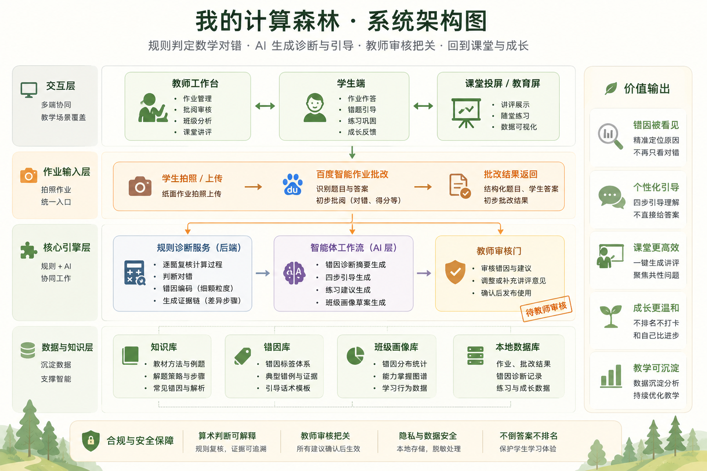

<div align="center">



# 🌲 我的计算森林

**✨ AI 批阅，教师把关 ✨** — 小学数学智能错因诊断与自适应练习系统

面向《创AI》全国中小学人工智能教育案例征集：用 🧠 规则判定数学对错，用 🤖 AI 生成诊断与引导，用 👩‍🏫 教师审核守住教育现场的最后一关。

[](https://www.python.org/)
[](https://www.typescriptlang.org/)
[](https://nextjs.org/)
[](https://fastapi.tiangolo.com/)


[GitHub](https://github.com/Floyud/calc-forest) · [Gitee](https://gitee.com/kwxxf/calc-forest) · [🎬 竞赛演示脚本](docs/competition/demo_video_script_v2.md)

</div>

<p align="center">
  
</p>

## 🤔 项目亮点

小学数学批改不只是判断“对”或“错”。同一道题错了，可能是退位、进位、运算顺序、基础事实、验算习惯等完全不同的问题；对应的教学干预也完全不同。

**我的计算森林**把作业批改变成一个可解释、可审核、可追踪的教学闭环：系统先定位错因，AI 生成诊断与引导建议，教师确认后再反馈给学生，最后沉淀为班级画像和个性化练习。

| 🎯 44 种错因 | ✅ 341 个测试 | 🧭 17 个页面路由 | 💾 33 张业务表 | ⚙️ 30+ 服务模块 |
|:---:|:---:|:---:|:---:|:---:|
| E-K/E-H 细粒度分类 | 覆盖诊断、批改、管道、端点 | 教师端、学生端、课堂屏 | 作业、画像、日志、成长数据 | OCR、诊断、报告、推荐、RAG |

## 🎬 实机演示

下面 5 段视频来自真实运行录屏。README 使用 MP4 链接而不是 GIF，保证清晰度，也避免仓库体积被动图拉大。

| 📋 作业生成 | 🔬 单题诊断 |
|:---:|:---:|
| <a href="docs/media/demo/01-homework-generation.mp4"></a><br><a href="docs/media/demo/01-homework-generation.mp4">观看：教师生成个性化作业</a> | <a href="docs/media/demo/02-single-diagnosis.mp4"></a><br><a href="docs/media/demo/02-single-diagnosis.mp4">观看：逐题错因诊断</a> |

| 🧑‍🏫 智能体辅助课堂练习 | 💡 四步引导 | 🌳 班级林园 |
|:---:|:---:|:---:|
| <a href="docs/media/demo/03-agent-class-practice.mp4"></a><br><a href="docs/media/demo/03-agent-class-practice.mp4">观看：课堂讲评与练习</a> | <a href="docs/media/demo/04-four-step-guidance.mp4"></a><br><a href="docs/media/demo/04-four-step-guidance.mp4">观看：学生端四步引导</a> | <a href="docs/media/demo/05-class-forest.mp4"></a><br><a href="docs/media/demo/05-class-forest.mp4">观看：成长森林反馈</a> |

## 🌟 核心能力

| 能力 | 说明 |
|:---|:---|
| 🔬 规则诊断，可解释 | 诊断引擎基于 regex + AST 分析，优先用规则复核计算过程，不把“判定对错”交给大模型黑箱。 |
| 👩‍🏫 教师审核门控 | AI 诊断与建议默认进入 `pending_teacher_review`，教师确认后才对学生生效。 |
| 💡 四步引导，不倒答案 | 学生端按“安慰、推理、归纳、练习”逐步引导，让学生自己发现错在哪里。 |
| 📋 作业全生命周期 | 支持程序化出题、学生提交、AI 批改、教师审核、PDF 报告、针对性练习。 |
| 🌳 成长型反馈 | 用成长树和班级林园反馈进步，不做排名榜，不制造额外竞争焦虑。 |
| 📷 多模态批改证据 | 支持百度智能作业与 PaddleOCR 识别，覆盖拍照上传、结构化批改结果与错因归档。 |

## 🖼️ 功能截图

| 教师工作台：先看班级现状 | 课堂模式：聚焦共性问题 |
|:---:|:---:|
|  |  |

| 学生端：引导学生自己想明白 | 成长森林：用进步代替排名 |
|:---:|:---:|
|  |  |

| 📷 竖式与判断改正题 | 📷 口算与连除应用题 |
|:---:|:---:|
|  |  |

## 🏗️ 系统架构

<p align="center">
  
</p>

## 🛠️ 技术栈

| 层 | 技术 | 要点 |
|:---|:---|:---|
| 🐍 后端框架 | FastAPI 0.115 | 异步 API、OpenAPI 文档、13 个路由器 |
| 💾 数据库 | SQLite + FTS5 | 33 张业务表，支持全文检索 |
| 🧠 规则引擎 | regex + AST | 44 种错因可解释诊断 |
| ⚛️ 前端框架 | Next.js 15.5 App Router | 教师端/学生端双布局，17 个页面路由 |
| 📊 可视化 | ECharts 6.x + Canvas | 雷达图、热力图、趋势线、森林粒子渲染 |
| 🤖 AI 平台 | Dify + DeepSeek/GLM | 智能体编排、RAG 检索、三级回退 |
| 🔍 本地模型 | BAAI/bge-m3 + jina-reranker | Embedding + Reranker，支持离线知识检索 |
| 🔊 语音 | Edge-TTS | 引导步骤语音合成 |
| 📷 OCR | 百度智能作业 + PaddleOCR | 拍照识别与自动批改 |
| 📄 报告 | xelatex + weasyprint | 作业单、学生报告、班级报告 |
| ✅ 测试 | pytest | 341 个测试，覆盖核心服务与流程 |

## 📁 项目结构

```text
calc_forest/
├── backend/                  # FastAPI 后端
│   ├── app/
│   │   ├── routers/          # API 路由
│   │   ├── services/         # 诊断、批改、报告、AI 服务
│   │   ├── pipeline/         # 批改管道
│   │   └── repositories/     # 数据访问层
│   ├── tests/                # pytest 测试
│   └── scripts/              # 种子数据、模拟器
├── web/                      # Next.js 前端
│   └── src/
│       ├── app/(teacher)/    # 教师端页面
│       ├── app/(student)/    # 学生端页面
│       └── components/       # 业务组件
└── dify/                     # Dify 工作流 DSL

docs/                         # 产品、工程、竞赛文档
knowledge_base/               # 数学知识库与错因体系
```

## 🚀 快速开始

### 📋 环境要求

- 🐍 Python 3.11+
- 💚 Node.js 18+
- 💾 SQLite 3（Python 内置）

### 🐍 后端

```bash
cd calc_forest/backend
pip install -r requirements.txt

pytest -s tests/ -q \
  --ignore=tests/test_e2e_smoke.py \
  --ignore=tests/test_dify_e2e.py \
  -k "not full_pipeline"

uvicorn app.main:app --host 127.0.0.1 --port 8000
```

### ⚛️ 前端

```bash
cd calc_forest/web
npm install
npm run dev
npx next build --no-lint
```

### 🎲 模拟数据

```bash
cd calc_forest/backend
python scripts/simulate_realistic.py
```

### 🔑 环境变量

```bash
cp .env.example .env
```

需要按实际情况配置 DeepSeek API Key、智谱 GLM API Key；Dify 为可选集成。

## 🎯 设计原则

| 原则 | 含义 |
|:---|:---|
| 🧠 对错判断只靠规则 | 大模型可以总结和解释，但不直接决定学生答案对错。 |
| 👩‍🏫 教师始终是决策者 | 所有 AI 输出必须经教师确认，不绕过审核。 |
| 💡 引导不倒答案 | 四步引导帮助学生自己发现问题，不直接给最终答案。 |
| 🔒 合成数据优先 | 演示数据为模拟生成，不使用真实学生隐私数据。 |
| 🌳 无排名、无打卡 | 关注个人成长，不制造竞争焦虑。 |

## 📚 文档入口

| 文档 | 说明 |
|:---|:---|
| [🔍 错因分类体系](docs/specs/04_error_taxonomy.md) | 44 种错因定义（E-K/E-H 全表） |
| [📋 MVP 范围](docs/specs/02_mvp_scope.md) | 已实现功能与未来扩展边界 |
| [🌱 产品愿景](docs/product/vision.md) | 产品价值、使用场景与长期方向 |
| [🎬 竞赛演示脚本](docs/competition/demo_video_script_v2.md) | 5 幕演示流程 |
| [📦 配套资源说明](Upload/04_配套资源/README.md) | 竞赛提交材料、截图与证据 |

## 🙏 致谢

本项目为《创AI》全国中小学人工智能教育案例征集参赛作品。

<div align="center">

**用成长代替焦虑，让每个孩子都看见自己的进步** 🌲🌱🌿

</div>

## 📜 License

MIT
