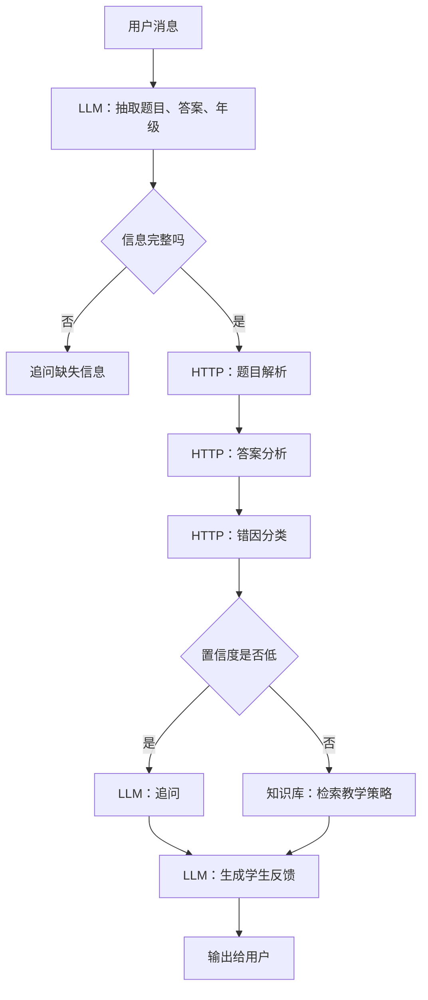

# Coze 备选方案

## 目标

Coze 作为 Dify-first 架构的备选平台，用于以下场景：

1. Dify 演示环境不可用时，快速切换到 Coze Bot。
2. 需要展示面向学生的对话式体验时，用 Coze 提供更轻量的入口。
3. 对比 Dify 与 Coze 在同一 prompt、同一 API、同一评测集下的输出一致性。

核心原则：Coze 只替换编排平台，不重写业务规则。Prompt、API schema、错因 taxonomy 和评测集保持一致。

本地工具服务仍使用：

```bash
/home/lyzhang/miniconda3/envs/pyt0
```

## Coze Bot 结构

| 模块 | 配置 | 对应 Dify 能力 |
| --- | --- | --- |
| Bot 人设 | 小学数学错因诊断学习助手 | 全局系统 Prompt |
| Workflow | 题目解析、答案分析、错因诊断、反馈生成 | Dify Workflow |
| 插件 / HTTP 工具 | 调用 FastAPI 接口 | Dify HTTP 节点 |
| 知识库 | 错因 taxonomy、教学策略、示例题 | Dify Knowledge |
| 变量 | `problem_text`、`student_answer_text`、`grade` | Dify 输入变量 |

## 迁移步骤

1. 创建 Coze Bot，设置系统人设为 `Prompt 注册表`中的全局系统约束。
2. 导入知识库：
   - 错因 taxonomy。
   - 小学数学知识点说明。
   - 典型错因案例。
   - 分年级讲解风格。
3. 配置 HTTP 工具：
   - `/api/diagnose`
4. 复用 Dify 的 Prompt ID 和变量名。
5. 用同一批 JSONL 测例做冒烟测试。

## Coze 对话入口设计

首轮引导：

```text
请把数学题和你的解题过程发给我。如果只写了答案也可以，我会先帮你看可能卡在哪里。
```

用户输入格式建议：

```text
年级：三年级
题目：小明有24颗糖，平均分给6个同学，每人分到几颗？
我的做法：24-6=18，所以每人18颗
```

Bot 内部抽取：

```json
{
  "grade": 3,
  "problem_text": "小明有24颗糖，平均分给6个同学，每人分到几颗？",
  "student_answer_text": "24-6=18，所以每人18颗"
}
```

## Coze Workflow 节点



## Coze Prompt 调整

Coze 的对话入口更自然，但也更容易出现模型自由发挥。建议加强以下约束：

1. 每次输出先判断是否需要更多信息。
2. 不要在低置信度时直接讲完整解法。
3. 对学生只展示必要字段，不展示内部错因 code。
4. 保留内部变量中的 `primary_error_code`，用于评测和日志。

面向学生输出模板：

```text
我看到你用了“{{student_expression}}”这一步。
这一步的计算可能没问题，但题目里的“{{key_phrase}}”表示要先想成几份。
你可以先想：{{guiding_question}}

小结：{{key_takeaway}}
```

## 风险与降级

| 风险 | 表现 | 降级方案 |
| --- | --- | --- |
| HTTP 工具不可达 | Coze 无法调用本地 API | 使用纯 Prompt 诊断，但标记为低置信度 |
| 知识库召回不足 | 讲解泛泛 | 在 Prompt 中内置最小 taxonomy |
| 输出过度自由 | 不符合 JSON 或直接给答案 | 强化系统约束，减少开放式节点 |
| 平台字段不一致 | 评测脚本难复用 | 统一导出为 API 中定义的 schema |

## 冒烟测试清单

1. 输入完整题目和错误答案，能返回错因、引导和练习。
2. 输入缺少年级，Bot 先追问年级。
3. 输入只有答案，Bot 先询问题目或解题过程。
4. 对连续退位减法错误，主错因应接近 `E03`。
5. 输出中不出现羞辱性表达。
6. Coze 输出可转换为与 Dify 一致的评测 JSON。

## 与 Dify 的差异记录

| 项目 | Dify | Coze |
| --- | --- | --- |
| 可视化工作流 | 更适合节点级调试 | 更适合对话 Bot 展示 |
| 日志评测 | 工作流日志更清晰 | 需要额外导出会话 |
| 知识库使用 | 适合工具化检索 | 适合对话场景补充 |
| 迁移难点 | 节点变量映射 | 输出格式约束 |

结论：Dify 保持主线，Coze 保持可用备份和对话展示入口，不把核心业务能力绑定在 Coze 专属配置上。
