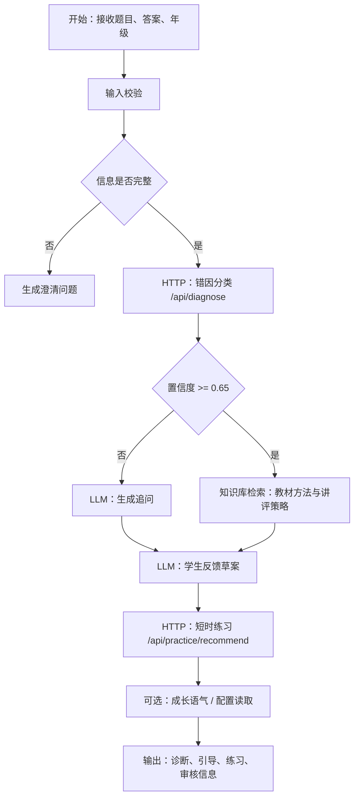

# Dify 工作流方案

## 工作流定位

Dify 是本项目的主交付平台，负责承载“我的计算森林”的教师侧主工作流。目标不是做一个会直接给答案的聊天机器人，而是让教师在短时间内得到：结构化错因、教材对齐的引导草案、短时巩固练习，以及可审核、可复盘的课堂支持信息。

当前比赛与工程口径同时保持以下边界：

- Dify 负责交互编排、知识库检索、日志留存和结果组织。
- FastAPI 规则服务负责算术正确性判断与结构化错因诊断。
- 教师审核负责最终课堂使用边界，所有 AI 输出默认待审核。

外部工具 API 使用本地或云端 FastAPI 服务，本地开发环境为：

```bash
/home/lyzhang/miniconda3/envs/pyt0
```

## 输入变量

| 变量 | 类型 | 必填 | 说明 |
| --- | --- | --- | --- |
| `problem_text` | string | 是 | 题目文本 |
| `correct_answer_text` | string | 是 | 标准答案 |
| `student_answer_text` | string | 是 | 学生答案或解题步骤 |
| `grade` | number | 是 | 年级，1-6 |
| `guidance_mode` | string | 否 | `standard`、`exploration`、`challenge` |
| `tree_species_id` | string | 否 | 预留字段，当前不作为主流程必需输入 |
| `student_profile` | object | 否 | 学习偏好、教材版本等 |

## 节点设计



## 节点说明

### 1. 输入校验

规则：

- `problem_text` 不能为空。
- `correct_answer_text` 不能为空。
- `student_answer_text` 不能为空。
- `grade` 必须在 1 到 6。
- 如果题目或答案明显缺失，直接进入澄清问题节点。

输出：

```json
{
  "valid": true,
  "missing_fields": [],
  "message": ""
}
```

### 2. 错因分类 HTTP 节点

调用：

```http
POST /api/diagnose
```

输出：

- `primary_error_code`
- `secondary_error_codes`
- `confidence`
- `evidence`
- `diagnosis_summary`

当前实现还会返回：

- `guidance_mode`
- `review_status`

请求映射建议：

- `problem_text` -> `problem`
- `correct_answer_text` -> `correct_answer`
- `student_answer_text` -> `student_answer`

### 3. 低置信度追问节点

条件：

```text
confidence < 0.65 或 needs_clarification = true
```

使用 `P_CLARIFY_QUESTION_V1`，只生成 1-3 个问题，不直接讲完整答案。

### 4. 知识库检索节点

Dify Knowledge 建议包含以下文档：

- 错因 taxonomy。
- 小学数学知识点说明。
- 典型错因案例。
- 分年级讲解风格。
- 巩固练习模板。

检索 query：

```text
年级={{grade}} 知识点={{knowledge_points}} 错因={{primary_error_code}}
```

### 5. 学生反馈节点

使用 `P_STUDENT_FEEDBACK_V1`。

输出结构：

```json
{
  "student_message": "",
  "key_takeaway": "",
  "next_step": ""
}
```

### 6. 巩固练习节点

调用：

```http
POST /api/practice/recommend
```

建议返回 2 到 3 道短时练习：

1. 同知识点、低难度。
2. 同错因、换情境。

### 7. 成长语气配置节点（可选）

调用：

```http
GET /api/tree-species
GET /api/encouragements
```

用途：

- 为品牌表达保留轻量成长语气。
- 不再让树种选择主导教师端主流程。

## 最终输出格式

```json
{
  "diagnosis": {
    "primary_error_code": "",
    "diagnosis_summary": "",
    "confidence": 0.0,
    "evidence": []
  },
  "student_feedback": {
    "message": "",
    "guiding_questions": [],
    "key_takeaway": ""
  },
  "practice": [],
  "debug": {
    "prompt_version": "v0.1",
    "taxonomy_version": "v0.1"
  }
}
```

## Dify 配置建议

1. 模型温度：诊断节点建议 `0.1-0.3`，反馈节点建议 `0.4-0.6`。
2. 输出格式：关键节点开启 JSON 输出约束。
3. 日志：保留每个节点输入输出，用于评测复盘。
4. 超时：HTTP 节点设置 10 秒超时，允许一次重试。
5. 知识库：top-k 建议 3，避免把过多资料塞进上下文。

## 今晚优先落地的 Dify 版本

如果只用一晚上构建，优先完成：

1. 单表单输入。
2. `POST /api/dify/session-draft` 先跑通完整教师侧闭环。
3. 后续再拆回 `POST /api/diagnose` 与 `POST /api/practice/recommend` 的更细粒度版本。
4. 一个教师侧总结输出。
5. 一个学生侧温和引导输出。

成长语气节点可以先准备好接口，但不阻塞教师端主链路打通。

## 当前可运行资产

### 夜间版

- 资产：`calc_forest/dify/my_calc_forest_dify_night_build.yml`
- 特征：单 HTTP 组合接口优先
- 目的：在无模型 provider、无 plugin 依赖的前提下，先把完整闭环跑通

### 正式版 V2

- 资产：`calc_forest/dify/my_calc_forest_dify_formal_v2.yml`
- 特征：多节点工作流，已拆成 `diagnose + practice + optional_tone_config + branch + assemble`
- 目的：把 Dify 编排逻辑从“组合接口闭环”推进到“接近正式产品”的结构化编排

V2 当前已跑通的链路：

```text
Start
  -> Build Diagnose Request (Code)
  -> Diagnose HTTP
  -> Parse Diagnosis (Code)
  -> If-Else by confidence
  -> Build Practice Request (Code)
  -> Practice HTTP
  -> Optional Tone Species HTTP
  -> Optional Encouragement Tone HTTP
  -> Assemble High Confidence (Code)
  -> End
```

其中两条 `Optional ...` 配置节点只服务品牌语气与展示表达，可按演示需要保留或关闭，不影响当前教师侧主链路成立。

当前配套资产：

- `calc_forest/dify/formal_workflow_design.md`
- `calc_forest/dify/knowledge_base_setup.md`
- `calc_forest/dify/knowledge_sources/`
- `calc_forest/dify/scripts/`

## V3 Upgrade Path

正式版下一步不是继续堆更多 HTTP，而是补这两层：

1. Knowledge Retrieval
2. LLM Teacher Summary / Student Guidance

原因：

- 当前 V2 已经证明编排层可运行。
- 后续真正需要增强的是“教材检索”和“年级化表达”。
- 这两部分接上以后，才能成为文档里最初设想的正式 Dify 版教师智能体。

**V3 状态更新（2026-05-19）：**

原阻塞项已解决：
- ✅ 本地模型 provider 已配置完成（BAAI/bge-m3 Embedding + Jina Reranker，port 8090）
- ✅ Dify Knowledge 已通过 `sync_to_dify.py` 脚本完成创建与绑定（5 个压缩文档）
- ✅ 本地 Dify 已部署（127.0.0.1:18080），3 个 App 已导入并发布
- 🔄 Cloud Dify 3 个 App 仍返回 401，需从 DSL 重新导入

## Demo 测试样例

输入：

```json
{
  "problem": "402-178=",
  "correct_answer": "224",
  "student_answer": "334",
  "grade": 4
}
```

期望输出要点：

- 主错因：`E-K03`（退位错误）
- 证据：个位和十位存在连续退位，学生结果未稳定体现退位过程
- 引导：询问“哪一位不够减？借位后前一位有没有少 1？”
- 练习：生成同类含 0 连续退位减法

## 与 Coze 的兼容点

1. Prompt ID 与变量名保持一致。
2. HTTP API schema 不使用 Dify 专属字段。
3. 知识库文档保持 Markdown 原文，可导入 Coze 知识库。
4. 输出 JSON 字段保持稳定，便于评测脚本复用。
